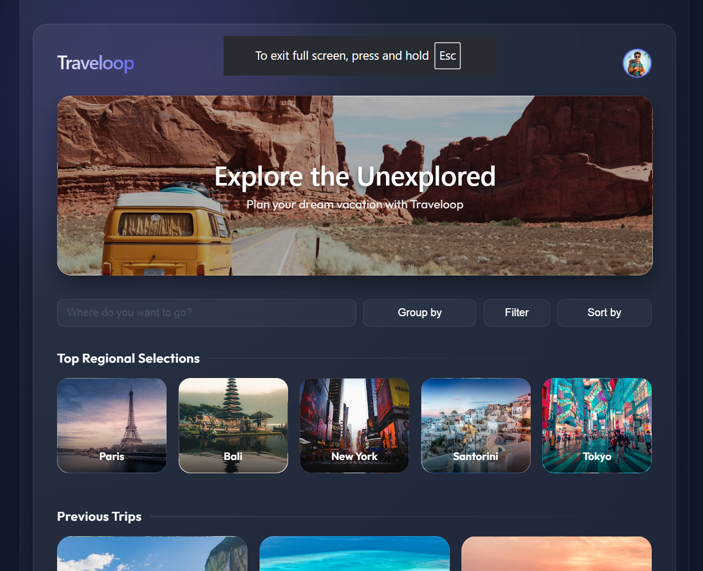
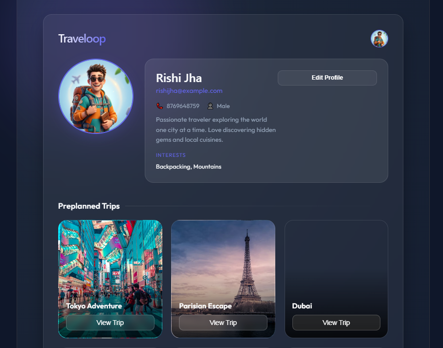

# Traveloop
Traveloop is a comprehensive web application designed to streamline the travel experience by combining trip planning, expense management, and community interaction into a single platform. Built using the MERN stack (MongoDB, Express, React, and Node.js), it provides travelers with a suite of tools to organize their itineraries and share insights with a global network of users.

<p align="center">   </p>


## Features

### 🌍 Trip Management
Create and manage detailed travel itineraries, including destination tracking and schedule organization.

### 💰 Expense Tracker
A dedicated module to log and monitor travel spending, helping users stay within their budget while on the road.

### ✅ Collaborative Checklists
Integrated packing and "to-do" lists to ensure no essential items or tasks are forgotten before or during a trip.

### 📝 Trip Notes
A personalized space for users to record memories, important location details, or quick reminders.

### 👥 Community Hub
A social platform where travelers can share their experiences, post updates, and discover tips from other members of the Traveloop community.

### 🔐 Personalized Profiles
Secure user authentication allowing travelers to maintain a history of their past trips and manage their public presence on the platform.

---

# Technical Overview

The project features a modern decoupled architecture:

## Frontend
A responsive single-page application (SPA) built with **React** and **Vite**, utilizing **React Router** for seamless navigation and **CSS3** for a clean, travel-focused UI.

## Backend
A robust **Node.js** and **Express** server handling RESTful API requests, user authentication, and data persistence.

## Data Management
Integration with **MongoDB** to store complex user data, trip details, and community contributions.
```
Traveloop/
├── .gitignore                          # Root-level git ignore rules
├── LICENSE                             # MIT License file
├── backend/                            # Server-side application
│   ├── package-lock.json               # Locked dependency versions
│   ├── package.json                    # Backend dependencies (express, sqlite3, cors)
│   ├── server.js                       # Express server and SQLite database logic
│   └── traveloop.db                    # SQLite database file (generated at runtime)
└── frontend/                           # Client-side React application
    ├── .gitignore                      # Frontend-specific ignore rules
    ├── README.md                       # Project documentation
    ├── eslint.config.js                # Linting configuration
    ├── index.html                      # Entry HTML file
    ├── package-lock.json               # Locked dependency versions
    ├── package.json                    # Frontend dependencies and scripts
    ├── vite.config.js                  # Vite build configuration
    ├── public/                         # Static assets
    │   ├── avatar.png                  # User profile placeholder
    │   ├── favicon.svg                 # Browser tab icon
    │   └── icons.svg                   # Sprite for UI icons
    └── src/                            # Application source code
        ├── App.css                     # Global application styles
        ├── App.jsx                     # Root component and routing logic
        ├── index.css                   # Tailwind or base CSS styles
        ├── main.jsx                    # Application entry point
        ├── assets/                     # Source-managed assets
        │   └── vite.svg                # Vite logo
        ├── components/                 # Reusable UI components
        │   └── navbar.jsx              # Navigation bar component
        └── pages/                      # Individual route components
            ├── Checklist.jsx           # Travel packing checklist page
            ├── Community.jsx           # Social/Community feed page
            ├── CreateTrip.jsx          # Trip planning form
            ├── Home.jsx                # User dashboard
            ├── Landingpage.jsx         # Main welcome/marketing page
            ├── Profile.jsx             # User account settings
            ├── Signin.jsx              # Login page
            ├── Signup.css              # Styles for the registration page
            └── Signup.jsx              # Registration page component
```
To run the Traveloop application, follow these steps to set up both the backend and frontend environments.

### 1. Prerequisites

Ensure you have the following installed on your machine:

* **Node.js** (v14 or higher)
* **npm** (Node Package Manager)
* **MongoDB** (Local instance or Atlas connection string)

### 2. Backend Setup

1. Navigate to the backend directory:
```bash
cd backend

```


2. Install dependencies:
```bash
npm install

```


3. Create a `.env` file in the `backend` folder and add your configuration:
```env
PORT=5000
MONGO_URI=your_mongodb_connection_string
JWT_SECRET=your_secret_key

```


4. Start the server:
```bash
npm start

```


The backend should now be running at `http://localhost:5000`.

### 3. Frontend Setup

1. Open a new terminal window and navigate to the frontend directory:
```bash
cd frontend

```


2. Install dependencies:
```bash
npm install

```


3. Start the development server:
```bash
npm run dev

```


The frontend will typically be available at `http://localhost:5173`.

### 4. Accessing the App

* Open your browser and go to `http://localhost:5173`.
* Register a new account via the **Signup** page to begin creating trips, managing expenses, and exploring the community features.

